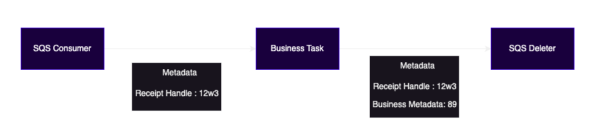

<center></center>


Vecna
=======

Vecna is a tiny library to build high concurrent applications easily and focusing on business. It already comes with a handful of general tasks created. 

**Batteries Included!**

### How it works

Vecna is based on two abstractions, `workers` and `tasks`. 

* `workers` are a pool of goroutines who interact with channels and execute `tasks`.
* `tasks` are objects capable of executing some computation and returning a value.

Workers will listen and produce on given channels, and execute tasks that you want with results from previous workers. In this way you'll built concurrent applications easily, **without needing to deal with the concurrency part**, you only need to create your tasks as you want and joy.


#### Metadata

Every worker and task will share the same metadata about the information being processed, this allows every task to read&append important informations that may be useful in the future. Ex. [SQSConsumer](pkg/task/sqs/sqs_consumer.go) task append to metadata each message receiptHandle to later be deleted from SQS queue by another task ([SQSDeleter](pkg/task/sqs/sqs_deleter.go)).



### Tasks Shipped with Vecna (More coming!)

Currently, four worker types are provided:

* [Producer](pkg/workers/producer.go): Worker pool who only produces messages to a channel based on `Task` execution response
* [Consumer](pkg/workers/consumer.go): Worker pool who only consume for a channel and execute tasks.
* [BiDirecional](pkg/workers/bi_directional.go): Worker pool who consumes from a channel, executes tasks and produces output on another channel.
* [EventBreaker](pkg/workers/event_breaker.go): Worker pool who consumes from a queue where results from the previous worker are listed, breaks it in various events to the next.

Some basic tasks are already provided (and welcome):

* [SQS Consumer](pkg/task/sqs/sqs_consumer.go) (to use with [SQS Deleter](pkg/task/sqs/sqs_deleter.go))
* [S3 Uploader](pkg/task/s3/s3_uploader.go)
* [S3 Downloader](pkg/task/s3/s3_downloader.go)
* [Decompressor (gzip/zstd)](pkg/task/compression/decompressor.go)
* [Compressor (gzip/zstd)](pkg/task/compression/compressor.go)
* [Json marshal/unmarshal](pkg/task/json/json.go)
* [HTTP Communicator to do HTTP requests](pkg/task/http_communicator/http_communicator.go)

But you're heavily encouraged to code your business logic too. Just implementing the [task interface](./pkg/task/task.go).

```go
type Task[T any, K any] interface {
	Run(context.Context, T, map[string]interface{}, string) (K, error)
}
```

## Monitoring

Vecna already comes with a solid set of logs needed to debug and monitor and with a basic interface `Metric` which recommended for use is with Prometheus. If you don't want to use metrics now, just use the `metrics.TODO` provided.

You can use the `metrics.PromMetrics`, just instantiate using `metrics.NewPromMetrics()` and register each metric on your Prometheus registry.

```go
vecnaMetrics := metrics.NewPromMetrics()
prometheus.NewRegistry().MustRegister(
    vecnaMetrics.EnqueuedMsgs,
    vecnaMetrics.ConsumedMsg
    ...
)
````

## How to use

To use just create your workers and tasks as you want. Check examples on [examples folder](examples/).

```go
metric := &metrics.TODO{}
	logger := slog.New(slog.NewTextHandler(os.Stdout, nil))

	sess, err := session.NewSession(&aws.Config{
		Region: aws.String("us-east-1"),
	})

	if err != nil {
		panic(err)
	}

	sqsClient := awsSqs.New(sess)

	sqsConsumer := workers.NewProducerWorker(
		"Event Created",
		sqs.NewSQSConsumer(sqsClient, logger, &sqs.SQSConsumerOpts{
			QueueName: "any-queue",
		}),
		10,
		logger,
		metric,
		500*time.Millisecond,
	)

	inputCh := make(chan *workers.WorkerData[[]*sqs.SQSConsumerOutput], 10)
	sqsConsumer.AddOutputCh(inputCh)

	breaker := workers.NewEventBreakerWorker[[]*sqs.SQSConsumerOutput, *sqs.SQSConsumerOutput](
		"break sqs messages",
		1,
		logger,
		metric,
	)

	breaker.AddInputCh(inputCh)

	msgsCh := make(chan *workers.WorkerData[*sqs.SQSConsumerOutput], 10)
	breaker.AddOutputCh(msgsCh)

	pathExtractor := workers.NewBiDirectionalWorker[*sqs.SQSConsumerOutput, string](
		"Path Extractor",
		&PathExtractor[*sqs.SQSConsumerOutput, string]{},
		1,
		logger,
		metric,
	)
	pathCh := make(chan *workers.WorkerData[string], 10)
	pathExtractor.AddInputCh(msgsCh)
	pathExtractor.AddOutputCh(pathCh)

	s3Client := awsS3.New(sess)

	s3Downloader := workers.NewBiDirectionalWorker(
		"Download Data",
		s3.NewS3Downloader(
			s3Client,
			"bucket",
			logger,
		),
		5,
		logger,
		metric,
	)
	s3Downloader.AddInputCh(pathCh)
	s3DownOutputCh := make(chan *workers.WorkerData[*s3.S3DownloaderOutput], 5)
	s3Downloader.AddOutputCh(s3DownOutputCh)

	// Other way of create intermediate workers without burocracy
	rawContentCh := make(chan *workers.WorkerData[[]byte], 10)
	go func() {
		for {
			out := <-s3DownOutputCh

			rawContentCh <- &workers.WorkerData[[]byte]{Data: out.Data.Data, Metadata: out.Metadata}
		}
	}()

	decompressor := workers.NewBiDirectionalWorker(
		"Decompress Data",
		compression.NewDecompressor(
			"gzip",
			logger,
		),
		5,
		logger,
		metric,
	)
	decompressor.AddInputCh(rawContentCh)
	decompressedCh := make(chan *workers.WorkerData[[]byte], 5)
	decompressor.AddOutputCh(decompressedCh)

	businessLogic := workers.NewConsumerWorker(
		"Process Data",
		&Printer[[]byte, []byte]{},
		5,
		logger,
		metric,
	)
	businessLogic.AddInputCh(decompressedCh)

	ctx := context.TODO()

	sqsConsumer.Start(ctx)
	breaker.Start(ctx)
	pathExtractor.Start(ctx)
	s3Downloader.Start(ctx)
	decompressor.Start(ctx)
	businessLogic.Start(ctx)
```

In this example, a simple logic is being made, consume message from SQS, Download object from S3 (Based on SQS Consumer output), and process it with some busines logic (custom Task).

## Creating your own tasks

To create your own task is simple, just follow the [Task interface](pkg/task/task.go), and a simple `Run()`` method is needed.

```
Run(context.Context, T, map[string]interface{}, string) (K, error)
``` 

## Extend Existent Code

All workers will consume its input channel (except producer worker which produces on it), you're able to put any message on it that your worker will read, this allows you to migrate or put a vector pipeline inside your application.

```go
type MyInput struct {
    Path string
}

s3Downloader := workers.NewBiDirectionalWorker(
    "Download Data",
    s3.NewS3Downloader(
        s3Client,
        "bucket",
        logger,
    ),
    5,
    logger,
    metric,
)

// Initialize other workers and call Executor

inputCh := s3Downloader.InputCh()

inputCh <- workers.WorkerData[MyInput]{Data: MyInput{Path: "path/to/s3"}, Metadata:  map[string]interface{}{}}
```

### Development

Currently in development:

* Accumulator Worker
* Kafka Consumer/Producer
